<p align="center">
  <a href="https://abdoslamb.github.io">
    
  </a>
</p>

<p align="center">
  <a href="https://abdoslamb.github.io"></a>
</p>

<p align="center">
  <a href="https://github.com/AbdoslamB/abdoslamB.github.io/actions/workflows/deploy.yml"></a>
  <a href="https://github.com/AbdoslamB/abdoslamB.github.io/actions/workflows/ci.yml"></a>
  
  
  
  
  
  <a href="LICENSE"></a>
</p>

The personal site of **Abdoslam Baabbad**, data scientist and business analyst: who I am, the open-source work I build, and what I write about.

## Highlights

- **Interactive hero.** Coloured dots that drift, link up and move out of the cursor's way, with a gentle scroll "hold" so one accidental flick never leaves the page.
- **Projects with live stats.** Curated by hand; GitHub stars and download counts refresh on every build and nightly.
- **Writing.** Markdown posts with tags, inline illustrations, collapsible sources and an RSS feed.
- **Fast and accessible.** Static HTML with a few kilobytes of JavaScript, AAA text contrast, full keyboard support and respect for reduced motion.
- **Dark and light themes,** remembered between visits.

## Quick start

Requires Node.js 22.12 or newer.

```sh
npm install
npm run dev        # http://localhost:4321, drafts included
```

| Command                          | Purpose                                        |
| -------------------------------- | ---------------------------------------------- |
| `npm run build`                  | Production build into `dist/`                  |
| `npm run preview`                | Serve the production build locally             |
| `npm run lint` · `npm run check` | Lint, then type-check                          |
| `npm test` · `npm run test:e2e`  | Unit tests, then browser tests (after a build) |

## Writing a post

Add a Markdown file to [`src/content/writing/`](src/content/writing/). The file name becomes the URL.

```md
---
title: 'Post title'
description: 'One or two sentences for cards, search results and link previews.'
date: 2026-10-03
tags: ['Python', 'Forecasting'] # the first three appear on the post card
sources: # optional, shown in a collapsed "Dig deeper" section
  - title: 'Article title, Publisher'
    url: 'https://example.com/article'
featured: true # optional: show on the homepage
draft: true # visible locally only; set to false to publish
---
```

Personal details, links and the projects list live in [`src/config/`](src/config/).

## Deployment

Every push to `main` is built and published to GitHub Pages by the [Deploy workflow](.github/workflows/deploy.yml), which also runs nightly to refresh project stats.

## License

[MIT](LICENSE). The heading font, [General Sans](https://www.fontshare.com/fonts/general-sans), is served by Fontshare under the ITF Free Font License and is not included in this repository.
