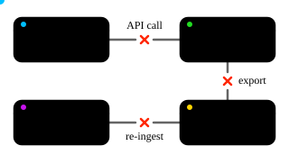
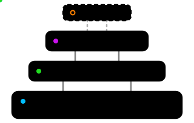
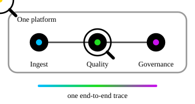

## The case against five different tools

There's a popular argument in data engineering right now: specialize everything. One SaaS tool for raw ingestion. A separate engine for transformations. Another platform for data quality. A disconnected tool for governance and risk. Each team gets its own hyper-specialized interface, and nobody gets locked into one vendor.

It sounds reasonable. It's also, in my experience, backwards.

Splitting your stack across five tools doesn't remove complexity, it just relocates it. Instead of living inside your architecture where you can see it, the complexity moves into the handoffs: network boundaries, brittle API calls, and mismatched operational models between teams who are all, technically, working on the same pipeline.

A centralized platform, built around functional layers instead of functional tools, handles this better. Not because fragmentation has no good arguments behind it — it has several, and they deserve real answers instead of a strawman. So here's the case, stress-tested against the strongest objections I could throw at it.

## "Different data needs different ecosystems" — does it, though?

The usual argument for fragmentation goes like this: ingestion, quality validation, and risk analysis are fundamentally different kinds of work. Forcing them into one system, the thinking goes, creates a bottleneck, where one team's workflow ends up slowing everybody else down.

That argument confuses two different things: architectural coupling and centralized coordination. You can run one platform without forcing every team to share the same tangled, brittle codebase.

Here's what that actually looks like in a well-layered system. The core pipeline runs as a base layer, and everything else, quality, governance, risk, attaches on top of it as its own independent layer, not a separate external tool. Three layers is just the simplest version of this to illustrate the idea. A real pipeline might split quality into its own rule-engine layer and a separate anomaly-detection layer, or break governance into regional-compliance and risk-scoring layers of their own. The exact count depends on what your tools and your pipeline actually need. What matters isn't the number, it's that each one stays layered on the same base instead of becoming its own disconnected tool:

- **Layer 0 — Base pipeline.** High-throughput data movement and normalization. This is the foundation everything else sits on.
- **Layer 1 — Data quality.** Automated rule assertions, anomaly thresholds, schema validation. Runs on top of the base layer without touching it.
- **Layer 2 — Governance and risk.** Regulatory constraints, risk calculations, compliance logic. The furthest downstream, and the most business-specific.
- **Layer 3 and beyond — whatever your pipeline actually needs.** Regional compliance variants, domain-specific risk models, a second quality pass for a different data source. Each one stacks on top of the same base instead of spinning up as a new tool.

Each layer runs its own logic independently. If a quality check fails, or someone needs to tweak a risk metric, that failure stays contained in its own layer. It doesn't ripple downstream unless there's an explicit dependency that says it should. Teams get real autonomy over their part of the pipeline without needing separate infrastructure, separate logins, or a fourth vendor contract to manage.

## "But doesn't spreading things across vendors protect me when one of them has a bad day?"

It's a fair question, and the instinct behind it is reasonable: keep your data-quality tool on a different vendor than your ingestion pipeline, and a bad day for one doesn't sink the other.

Except it does. Just one step removed.

If your base pipeline fails, the downstream layers were never going to have data to process anyway, fragmented or not. A separate data-quality SaaS tool with nothing arriving from a dead ingestion job isn't protected. It's just idle. The failure still cascades. It just cascades across a network boundary instead of inside one platform, where you could actually see it happening.

On the smaller failures, the ones where a single layer has a bad day without the base going down, a well-built dependency structure is its own detection system. If Layer 1 expects a run on a schedule and it doesn't show up, that's a fast, specific signal pointing exactly at where the problem is. Compare that to a missed handoff between two unrelated SaaS tools, which usually just shows up as a vague timeout, with no shared observability to trace it back to a root cause.

Fragmentation doesn't eliminate blast radius. It relocates the same blast radius across a tool boundary, and loses the shared visibility that would have made it fast to diagnose.

There's a second problem hiding underneath the vendor-risk argument, too. Most teams running their "own" data-quality tool, or their "own" risk engine, aren't actually doing fundamentally different work from the team next door. They're solving close variations of the same problem, validation rules, anomaly thresholds, compliance checks, reinvented per tool with slightly different schemas and conventions. Fragmentation's flexibility is often illusory. It isn't buying genuine diversity of approach. It's buying redundant reimplementations of the same category of logic, dressed up as team autonomy.

## "Doesn't my team lose control of its own roadmap?"

This is the sharper version of the autonomy question, and it splits into two parts.

When a team runs its own standalone tool, it controls its own release schedule and is the one on call when it breaks. Move that same logic onto a shared platform as "Layer 1," and the team is suddenly dependent on however the platform prioritizes things. If the platform team is heads-down on a migration, that layer's new feature waits.

That's true, for exactly one kind of request. There's a real difference between _writing your own logic on top of the platform_ and _needing the platform itself to do something it can't do yet_. A genuinely extensible platform, the kind that lets teams build their own rules, validations, and risk logic the way a tool like Informatica lets them, keeps the first case entirely in the team's hands. They write it, they ship it, on their own schedule. The roadmap dependency only shows up in the second case, when the ask isn't "let me build my logic" but "change what the platform can do", and that kind of request is rare by design, not by luck.

When it does happen, there's coordination friction and a short delay. That's a real cost. But it's a worthwhile trade against the alternative: five teams permanently maintaining five separate pieces of infrastructure, forever, instead of occasionally waiting a few days for a shared platform change.

Here's the condition worth being honest about: this whole argument only holds if the platform is actually that flexible. A rigid, narrow platform that forces every team through the same inflexible mold _would_ have the ownership problem, and no amount of architecture theory fixes that. Centralization isn't automatically fine. It's fine when the platform earns it.

## Won't cramming everything into one platform just create a bottleneck?

This is the other big objection: if ingestion, deep quality checks, and risk simulations all run inside the same shared platform, won't they fight each other for compute and slow everything down?

Maybe, if you built it the naive way. But scattering those same workloads across five separate SaaS tools doesn't avoid that problem. It just stacks new ones on top: network transfer overhead, redundant serialization and deserialization, and scheduling delays every time one orchestrator has to wait on another.

Real scale comes from parallelization and smart compute placement, not from drawing more boundaries:

- **Unified distributed compute.** Run quality rules and transformations against the same in-memory distributed dataset, something like Spark, without writing to disk or shipping data across a network in between.
- **Parallel layer execution.** Layers that don't depend on each other, quality auditing and risk attribution, say, can run at the same time, against the same data snapshot.
- **Pushdown, not pull.** Run validations as close to where the data already lives as possible, instead of moving the dataset to wherever the tool happens to be hosted.

Fragmentation doesn't remove the performance tax. It just hides it inside "operational overhead" instead of a compute bill you can actually see.

## "Where's the proof this actually works?"

Fair challenge. Everything so far has been argued from first principles, failure domains, compute placement, dependency contracts, and a skeptical engineer is right to want more than "sounds good in theory."

There isn't a tidy "Company X cut latency 40%" case study here. But there is a signal worth taking seriously: the market has already been voting with its feet. Teams keep consolidating onto platforms like Informatica, KNIME, and similar cloud-based ecosystems, specifically because doing the same category of work across five disconnected tools wasn't winning. That's not a benchmark number. It's closer to revealed preference, weaker evidence than a controlled study, but not nothing.

That said, this argument isn't universal, and it shouldn't pretend to be. It holds tightly when the shape of the data and pipeline problem is stable, even if the business logic running on top of it changes constantly. Finance, insurance, and sales are good examples: the math, the risk models, and the analysis choices change all the time, but what a transaction record or a policy record _looks like_, and how you move and validate it, is comparatively settled. The platform doesn't need re-architecting every time the business changes its scoring model. It just needs new logic written on top of the same layers.

Contrast that with a company inventing an entirely new product category, where the data formats and pipeline shape themselves are still unstable because nobody's built this kind of thing before. That's the case where a rigid layered platform fights the business instead of serving it.

So the honest version of the claim isn't "centralization always wins." It's: centralization wins once the shape of your data problem is settled, no matter how often the thinking on top of it changes.

## "What about compliance, acquisitions, and team boundaries? Isn't fragmentation sometimes deliberate?"

Sometimes, yes, and it's worth engaging with the strongest version of that case instead of the weakest one. Real fragmented stacks often aren't five tools picked at random. They're kept separate on purpose: compliance rules that require segregation of duties, independent audit trails, or a merger that inherited someone else's entire stack along with the acquisition.

Look closely at what compliance actually requires, though, and it's rarely "these must run on different infrastructure." It's "person A cannot approve or modify person B's logic, and each domain needs independently controlled access." That requirement is satisfiable, often more cleanly, _inside_ a layered platform: scope permissions per layer, so the quality team can write and change Layer 1, the risk team owns Layer 2, and neither can touch the other's layer or the shared base. Separate tools were never the actual compliance requirement. They were one historical way to satisfy it, back when fine-grained, role-based access control inside a single platform was harder to build than it is today.

Acquisition history and team boundaries are really the same story wearing a different hat. They're about who can access and approve what, not about which tool the logic happens to run in.

And here's the part that undercuts the "separate tools protect isolation" argument entirely: even in a fragmented stack, the tools aren't actually isolated. They still read from each other, or from a shared warehouse, to get the data they need to do their job. The data was always flowing across that boundary. A layered platform doesn't introduce that flow, it just stops duplicating it. Instead of exporting, copying, and re-ingesting the same dataset every time it crosses a tool boundary, you read it once, in place, and every layer downstream works off the same copy.

Fragmentation was never really an architecture for isolation. It was a workaround for access control that a well-designed layered platform can now do natively, without the cost of the same data sitting in five different places.

## The thing fragmentation can't give you back: the whole picture

Everything above has been playing defense, answering the best objections to centralizing. There are also genuine, positive reasons to do it that have nothing to do with rebutting anyone.

The first is visibility. When your base pipeline, your quality layer, and your governance layer all run through the same shape on the same platform, you can trace a piece of data's entire journey end to end, in one place, through one observability model. That's what makes real optimization possible: you can see where the actual bottleneck is across the whole chain, not just inside one tool's narrow view of its own step.

In a fragmented stack, each tool can tell you how it performed in isolation. Nobody has the full picture of how a department's data actually moves from raw ingestion to a finished risk score. You can optimize one tool in isolation and accidentally make the overall system worse, because you can't see how that change ripples into the next handoff. Fragmentation trades away systems-level optimization in exchange for component-level autonomy, and most teams don't realize they made that trade until they're debugging something that spans three tools and nobody owns the whole path.

## And when a new policy needs to land everywhere at once

The second positive argument is governance. Introduce a new policy, a new data-quality standard, a new rule about how pipelines should be structured, on a unified platform, and it applies everywhere at once, consistently, because every team runs on the same underlying system.

Try that across five disconnected tools and you're stuck choosing between two bad options: water the policy down to whatever the weakest tool in the chain can technically support, which makes it generic and toothless, or accept that it'll land inconsistently, clean in the tool that handles it well, hacked around in the one that doesn't, simply unsupported in a third. Either way, fragmentation doesn't just slow policy rollout down. It degrades the policy itself.

## How to actually get there

None of this is an argument for ripping out your stack overnight, and it's worth asking honestly whether the migration itself is worth the pain.

It usually is, as long as you treat it like any other engineering change instead of something uniquely risky. The risk during a transition isn't really about consolidation versus fragmentation, it's about whether you have good data retention and change-management discipline in the first place. Keep your execution history properly, in something like Hadoop or an equivalent cold store, and follow a real SDLC: versioning, staged rollout, testing before production. Do that, and introducing a new layer carries the same manageable risk as shipping any other feature. The migration isn't inherently more dangerous because you're consolidating. It's exactly as risky as any change you manage well, or badly.

A few concrete steps, if your stack is already fragmented:

1. **Map every handoff.** Find every point where data crosses from one standalone tool to another, and flag the unnecessary network hops and redundant staging tables along the way.
2. **Pick one base engine.** Consolidate ingestion and heavy compute onto a single distributed framework that can run shared, in-memory jobs. Spark is the obvious default.
3. **Turn rules into layers, not tools.** Rebuild your quality checks and compliance logic as independent modules that run on top of your data, not separate systems that pull it away first.
4. **Scope access per layer, not per tool.** Define who can write, approve, and deploy inside each layer up front. That's how segregation-of-duties lives in permissions instead of in separate infrastructure.
5. **Let failures stay local.** Set up your orchestration so a failed validation triggers an alert inside its own layer. It shouldn't take down the whole pipeline unless it's actually supposed to.
6. **Write down your dependencies.** Define clear contracts between layers, so a downstream model only breaks when something it actually depends on changes, not every time anything upstream moves.

## Final thoughts

None of this means every specialized tool is wrong, or that centralization is free. It takes real engineering discipline to build a platform flexible enough that teams don't quietly lose autonomy, and layers independent enough that a failure in one doesn't take down everything else by accident. Get that wrong, and centralization earns every criticism in this piece.

But get it right, and the honest version of this argument is stronger than the first draft of it: centralization wins when your platform is genuinely extensible and the shape of your data problem is stable, even while the business logic on top of it keeps changing. It gives you things fragmentation structurally can't: a system you can see end to end, and a policy you can land everywhere at once instead of five different versions of it.

Fragmentation was never free either. It just sent the bill somewhere harder to see: duplicated logic, blind spots at every handoff, and a policy that only half the stack can actually enforce.

Is your stack fragmented, or layered, and if someone pushed back hard on it, would it hold? I'd love to hear how you're handling it. [Let me know](/#contact).

Thanks for following the pipeline.

